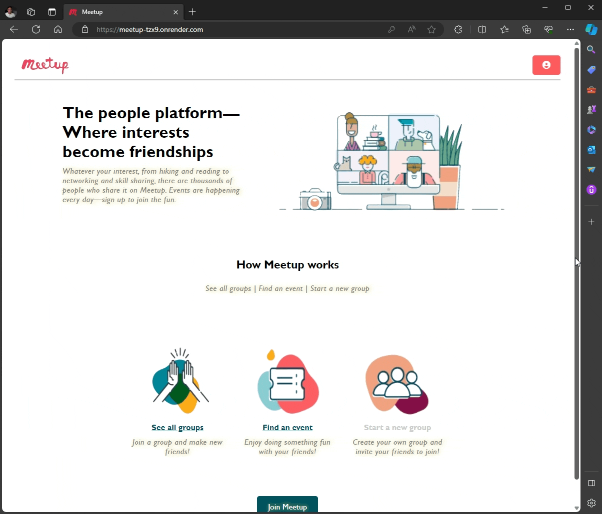

# Meetup

## https://meetup-tzx9.onrender.com/

## Database Schema Design

![meetup-database-schema]

[meetup-database-schema]: https://meetup2024.s3.us-west-2.amazonaws.com/public/meetup-database-schema.png
[meetup-db-diagram-info]: https://appacademy-open-assets.s3.us-west-1.amazonaws.com/Modular-Curriculum/content/week-12/meetup-db-diagram-info.txt

## Demo
### Login - Logout


### Signup


### Update Password


### Update User Profile


### Create group


### Create event


### Update event


### Update group


### Pagination


### Searchbox


### Upload Event Image


### Delete Event Image


### Upload Group Image


### Delete Group Image


### Request to Join Group


### Request to Attend Event


### Membership Roles


### Update Membership


### Remove Membership


### Attendance Roles


### Update Attendance


### Remove Attendance


### Event Sorting


### Error Handling


### Event Gallery View


### Group Gallery View


### View Memberships


### View Attendances


### Delete Event


### Delete Group


### Delete Group cascades Events


### Delete Account


### View Group Venues


### Create Group Venues


### Update Group Venues


### Delete Group Venues


### Create In-person events


### Update In-person events


### Global Notification system


### General Live Chat


## Techologies
* PERN Stack
  * Postgres (Sqlite in development)
  * Express
  * React (Redux for state management)
  * Node
* Sequelize
  * ORM for easier CRUD operations on the database
* Dyanmic seedings
  * A variety of seeds are dynamically created for testing and demo purposes without hard-coding
* Google Maps Javascript API
  * Integrated Google Map API into the application to allow real-time interaction with 3D map
* Google Geocoding API
  * Converting addresses into geographic coordinates
  * Improve user's experience by not having to enter specific latitude and longitude
* AWS
  * Cloud hosting service for image(s) uploading
* Socket.io API
  * Allows real-time notification system and live-chat
* Multer
  * Middleware to handle multipart/form-data
* Redux State Hydration
  * Avoid unecessary fetches from the database, speed up application, and increase users' experience while ensuring data integrity across pages
* React Routers
  * Easy navigating between pages within the application
* React Context
  * Avoid props threading, used to store small-size global data
* Vite
  * Used for React project templates
* CSRF Protection
  * By exchanging tokens for non-GET requests
* Prevent SQL injections
  * By sanitize queries input
* Prevent Rainbow Table attacks (bcrypt)
  * By salt and hash passwords before storing in the database
* Prevent XSS attacks
  * Force all inputs to be text
  * Also applied csrf practice mentioned above for extra layer of protection
* CORS
  * Enabled during development
* DBDiagram
  * Used for design and sketch database schema, assign associations amongst tables
* Eslint
  * Used for consistent styling
* Data Racing
  * Avoid false positive due to fast button clicks
  * Avoid multiple CUD records being sent to the database by ensuring CUD signals are only processed once

## Design Principles and Techniques
* Simple
  * Compact
    * Only necessary information is displayed
  * Intuitive navigating
    * Logo on the left
    * User menu on the right
    * Red color for error messages
    * Green color for successful messages
  * Flexible
    * Easy to input dates
    * Form input tolerance
      * ex: "City, State" or "City State" or "City,State"
* Clear
  * Disabled buttons/links are signaled via visual cues such as
    * using not-allow cursor-pointer
    * hightlight with a darker color
    * disallowed hovering effects
* White space
  * Respect user's white space
  * Only horizontal lines are used for spacing
  * Items are displayed proportionally and spaced accordingly in a way that
    * is easy to read
    * is comfortable to look at
* Colors
  * Maximum 3 main colors per page
  * Ensure color on text is easy to read
  * Avoid high contrast colors that are hard to read
* Accessible and Convinient
  * An action can be done by the user on many pages
  * All images come with an "alt" tag for description

## Features
* User authentication
  * Signup
    * Anyone is allowed to sign up
    * "username" and "email" must be unique
    * Allows user to upload an avatar (optional)
      * If no avatar is provided, a default avatar will be used
  * Login
    * Create session
    * Set CSRF token
  * Logout
    * Delete session
    * Remove CSRF token
  * Update Password
    * Allows user to update password after signed up
    * Password is required
  * Delete account
    * All groups/events/memberships/attendances that associated of the user are also removed
  * Forgot Password
    * (coming soon)
* User authorization
  * Ensure protection on protected routes
* Roles
  * Display data based on the current user's role (more on Memberships and Attendances)
* Global Messages
  * Display friendly messages to user via modals
  * Message content can varied based on different scenarios
* Glbal Error Handling
  * Avoid invalid routes
  * Display helpful messages when route is not found
  * Prevent user to abuse the system by navigating via the URL
* Searchbox
  * Search for groups/events with real-time response
  * Search for provided substring
  * Only search for results that are already loaded from the database
    * If user views the first "n pages" from the group overiew pages, then ONLY the first "n pages" are included in the search
    * If the user had loaded all pages and are currently on any random page, all pages are included in the search
  * Only highlight results on "current page"
  * When the first letter is entered
    * Highlight results are on current page
    * Results before the first highlight are from previous page
    * Results after the last highlight are from next page
  * From the second letter
    * All matched results are highlighted since they are now on "current page"
* Simple Image Upload
  * Allow users to quickly upload event images, group images, avatar, etc
  * Choose a file, no URL needed
* Pagination
  * Allow users can choose number of results to be returned
  * Allow users can go to an atritrary page from any pages
* Sorting
  * Upcoming events are display first, ordered by most upcoming events
  * Past events are display last, ordred by events that are closer to the current date
* Groups overview
  * Display a list of all groups, can applied pagination and searchbox
* Events overview
  * Display a list of all events, can applied pagination and searchbox
* Your Profile
  * Display an overview page that is customized for the currently logged in user
  * Displays helpful statistics to the user including
    * list of groups joined/owned
    * list of events hosted/attended
    * number of groups joined/owned
    * number of gevents hosted/attended
  * Links to each section mentioned above are also provided
    * when a link to a section is clicked, a user will be scrolled to that section
  * Events are sorted as mentioned above
* Update User Profile
  * Allows user to change firstNam, lastName, or avatar after signed up
  * "username" and "email" are not allowed to change
  * Password is required
* Your Groups
  * Display a list of all groups that are owned, joined(or requested to join) by the current user
  * Display each group status with regard to the user (joined, pending, etc)
* Your Events
  * Display a list of all events that are hosted, attended(or requested to attend) by the current user
  * Display each event status with regard to the user (attended, pending, waitlist, etc)
* Group Details
  * Display all information regarding the group, including a list of events belonged to that group, organizer, group's type, descrtiption, etc
* Event Details
  * Display all information regarding the event, including event's price, capacity, host, etc
  * Display Venue information, including map and directions for in-person event (coming soon)
* Group Gallery
  * Display group images
  * Everyone can see public group's images
  * Only members are allowed to see private group's images
  * All members are allowed to upload group images
  * Only organizer is allowed to update and delete images
* Event Gallery
  * Display event images
  * Everyone can see public event's images
  * Only attendees are allowed to see private event's images
  * All attendees are allowed to upload event images
  * Only host is allowed to update and delete images
* Memberships Overview
  * Display a list of all members belonged to the group
  * Everyone can see members
  * Only owner/co-hosts can see pending members
* Request Group Membership
  * Allows user to request membership to the group on the group details page
  * User's status changed to pending when the request is sent
* Update Group Membership
  * Owner and co-hosts are allowed to accept new members(pending -> member)
  * Only owner is allowed to change member's status (pending -> member <-> co-host)
  * Owner can change member status directly from pending to co-host, or from co-host back to member
  * User's status updates accordingly to after user is accepted into a group
* Remove Group Membership
  * Group membership can be canceled when
    * A member unjoins a group
    * Owner removes member
  * When user leaves, all of the events belonged to the group that attended(or request to attend) by the user will also be removed
  * Data is updated accordingly on the group details page and "Your groups" page to reflect this change
  * If co-host unjoins a group
    * The Membership page is also updated to hide pending members
    * Event details pages that belong to that group are also updated to reflect user's status changes
* Attendances Overview
  * Display a list of all attendees belonged to the event
  * Everyone can see attendees and people who are in the waitlist
  * Only host/co-hosts can see pending attendees
* Request Event Attendance
  * Allows user to request attendance to the event on the event details page
    * User can only request attendance to events that belonged to a group that the user is a member of
  * User's status changed to pending when the request is sent
  * User's status changed to waitlist if being accepted by host/co-host (can attend if there is space left)
* Update Event Attendance
  * Co-hosts are allowed to accept new attendees to waitlist(pending -> waitlist)
  * Co-hosts are NOT allowed to accept themselves to the waitlist
  * Only host is allowed to change anttendee's status (pending -> waitlist <-> attending)
  * Host can change attendee's status directly from pending to attending, or from attending to waitlist
  * User's status updates accordingly to after user is accepted into an event
* Remove Event Attendance
  * Event Attendance can be canceled when
    * A user unattends an event
    * Host removes attendee
  * Data is updated accordingly on the event details page and "Your events" page to reflect this change
* Start a new Group
  * User can only start a new group after logged in
  * User can optionally update a group image, if no image is provided, a default image will be used
  * Hanlde errors in the frontend before sending it to the database to improve user experience, and boosting app's speed
  * When submitted, if there is error, user will be scrolled to the section with that error
  * Data is updated accordingly in "Your Groups" and "Your Profile" pages
* Start a new Event
  * User can only start a new event after logged in and is the owner of the group
  * User can optionally update an event image, if no image is provided, a default image will be used
  * Hanlde errors in the frontend before sending it to the database to improve user experience, and boosting app's speed
  * When submitted, if there is error, user will be scrolled to the section with that error
  * Data is updated accordingly in "Your Events", "Your Profile", and "Group Details" pages
* Update a Group
  * Only owner can update the group
  * Pre-filled with existing group's data
  * User can also update the group's image
  * If no image is provided, the previous state of the image remains unchanged
  * Data is updated accordingly in "Groups Overiew", "Group Details", "Your Groups" and "Your Profile" pages
* Update an Event
  * Only host can update the event
  * Pre-filled with existing event's data
  * User can also update the event's image
  * If no image is provided, the previous state of the image remains unchanged
  * Data is updated accordingly in "Events Overiew", "Event Details", "Group Details", "Your Events" and "Your Profile" pages
* Delete a Group
  * Only owner can delete the group
  * When the group is deleted, all events associated with the group will also be deleted
  * Data is updated accordingly in "Groups Overiew", "Your Groups" and "Your Profile" pages
* Delete an Event
  * Only host can delete the event
  * Data is updated accordingly in "Events Overiew", "Group Details", "Your Events" and "Your Profile" pages
* View Group Venues
  * View venues that belongs to a group in the group details page
  * User must be signed in to view public groups' venues
  * Only members can view private groups' venues
* Create Group Venue
  * Only owner and co-host can create group venues
  * Only address is required, the geographic location will be filled in automatically behind the scene
* Edit Group Venue
  * Only owner and co-host can edit group venues
  * Only address is required, the geographic location will be filled in automatically behind the scene
* Delete Group Venue
  * Only owner can delete group venues
* Create In-person events
  * In person events must have a venue, if group has no venue, then a new venue must be created first
  * Venue's input will be disabled and ignored for online events
  * User can easliy select available group's venues from dropdown
* Edit In-person events
  * Event's type can be changed from 1 type to another and venue will be updated accordingly
* Global Notification System
  * Notify the user whenever an event related to the user happens in real-time
  * Only signed-in users can receive notification
  * Events include:
    * General
      * A group is created - updated - deleted
      * An event is created - updated - deleted
    * Membership
      * Owner/co-hosts are notified whenever a user request to join a group
      * User gets notified when being accepted into a group, or promoted to co-host
      * If a user unjoins a group, notify the user and the group owner
      * If a user is being removed from a group, notify the user
    * Attendance
      * Host/co-hosts are notified whenever a user request to attend an event
      * User gets notified when being accepted into an event's waitlist or accepted to attend the event
      * If a user unattends an event, notify the user and the event host
      * If a user is being removed from an event, notify the user
    * GroupImages
      * Group's members are notified when a new image is posted or when an image is deleted
    * EventImages
      * Event's attendees, host, and co-hosts are notified when a new image is added to an event, or when an image is deleted
* General Live Chat
  * Public chat available to all signed-in users
  * Allows users to chat in real-time
  * If new messages are received and the chat window is minimize, a signal will be shown to notify the user of new messages
  * Each message's timestamp can be view by clicking into the message

## API Documentation

## USER AUTHENTICATION/AUTHORIZATION

### All endpoints that require authentication

All endpoints that require a current user to be logged in.

* Request: endpoints that require authentication
* Error Response: Require authentication
  * Status Code: 401
  * Headers:
    * Content-Type: application/json
  * Body:

    ```json
    {
      "message": "Authentication required"
    }
    ```

### All endpoints that require proper authorization

All endpoints that require authentication and the current user does not have the
correct role(s) or permission(s).

* Request: endpoints that require proper authorization
* Error Response: Require proper authorization
  * Status Code: 403
  * Headers:
    * Content-Type: application/json
  * Body:

    ```json
    {
      "message": "Forbidden"
    }
    ```

### Get the Current User

Returns the information about the current user that is logged in.

* Require Authentication: false
* Request
  * Method: GET
  * URL: /api/session
  * Body: none

* Successful Response when there is a logged in user
  * Status Code: 200
  * Headers:
    * Content-Type: application/json
  * Body:

    ```json
    {
      "user": {
        "id": 1,
        "firstName": "John",
        "lastName": "Smith",
        "email": "john.smith@gmail.com",
        "username": "JohnSmith",
        "profileImageUrl": null
      }
    }
    ```

* Successful Response when there is no logged in user
  * Status Code: 200
  * Headers:
    * Content-Type: application/json
  * Body:

    ```json
    {
      "user": null
    }
    ```

### Log In a User

Logs in a current user with valid credentials and returns the current user's
information.

* Require Authentication: false
* Request
  * Method: POST
  * URL: /api/session
  * Headers:
    * Content-Type: application/json
  * Body:

    ```json
    {
      "credential": "john.smith@gmail.com",
      "password": "secret password"
    }
    ```

* Successful Response
  * Status Code: 200
  * Headers:
    * Content-Type: application/json
  * Body:

    ```json
    {
      "user": {
        "id": 1,
        "firstName": "John",
        "lastName": "Smith",
        "email": "john.smith@gmail.com",
        "username": "JohnSmith",
        "profileImageUrl": null
      }
    }
    ```

* Error Response: Invalid credentials
  * Status Code: 401
  * Headers:
    * Content-Type: application/json
  * Body:

    ```json
    {
      "message": "Invalid credentials"
    }
    ```

* Error response: Body validation errors
  * Status Code: 400
  * Headers:
    * Content-Type: application/json
  * Body:

    ```json
    {
      "message": "Bad Request", // (or "Validation error" if generated by Sequelize),
      "errors": {
        "credential": "Email or username is required",
        "password": "Password is required"
      }
    }
    ```

### Sign Up a User

Creates a new user, logs them in as the current user, and returns the current
user's information.

* Require Authentication: false
* Request
  * Method: POST
  * URL: /api/users
  * Headers:
    * Content-Type: application/json
  * Body:

    ```json
    {
      "firstName": "John",
      "lastName": "Smith",
      "email": "john.smith@gmail.com",
      "username": "JohnSmith",
      "password": "secret password",
      "profileImageUrl": "Image File"
    }
    ```

* Successful Response
  * Status Code: 200
  * Headers:
    * Content-Type: application/json
  * Body:

    ```json
    {
      "user": {
        "id": 1,
        "firstName": "John",
        "lastName": "Smith",
        "email": "john.smith@gmail.com",
        "username": "JohnSmith",
        "profileImageUrl": "Image URL"
      }
    }
    ```

* Error response: User already exists with the specified email
  * Status Code: 500
  * Headers:
    * Content-Type: application/json
  * Body:

    ```json
    {
      "message": "User already exists",
      "errors": {
        "email": "User with that email already exists"
      }
    }
    ```

* Error response: User already exists with the specified username
  * Status Code: 500
  * Headers:
    * Content-Type: application/json
  * Body:

    ```json
    {
      "message": "User already exists",
      "errors": {
        "username": "User with that username already exists"
      }
    }
    ```

* Error response: Body validation errors
  * Status Code: 400
  * Headers:
    * Content-Type: application/json
  * Body:

    ```json
    {
      "message": "Bad Request", // (or "Validation error" if generated by Sequelize),
      "errors": {
        "email": "Invalid email",
        "username": "Username is required",
        "firstName": "First Name is required",
        "lastName": "Last Name is required"
      }
    }
    ```

### Edit a User

Edits an existing user, returns the current user's updated information. Note that password, username, and email are used for permission.

* Require Authentication: true
* Request
  * Method: PUT
  * URL: /api/users
  * Headers:
    * Content-Type: application/json
  * Body:

    ```json
    {
      "firstName": "John 2",
      "lastName": "Smith 2",
      "email": "john.smith@gmail.com",  // can't be edited
      "username": "JohnSmith",  // can't be editted
      "password": "secret password",
      "profileImageUrl": "Image Url 2"
    }
    ```

* Successful Response
  * Status Code: 200
  * Headers:
    * Content-Type: application/json
  * Body:

    ```json
    {
      "user": {
        "id": 1,
        "firstName": "John 2",
        "lastName": "Smith 2",
        "email": "john.smith@gmail.com",
        "username": "JohnSmith",
        "profileImageUrl": "Image Url 2"
      }
    }
    ```

* Error response: Body validation errors
  * Status Code: 400
  * Headers:
    * Content-Type: application/json
  * Body:

    ```json
    {
      "message": "Bad Request", // (or "Validation error" if generated by Sequelize),
      "errors": {
        "email": "Invalid email",
        "username": "Username is required",
        "firstName": "First Name is required",
        "lastName": "Last Name is required",
        "credential": "Email or username is required",
        "password": "Password is required"
      }
    }
    ```

### Edit a User Password

Edits an existing user's password, returns successful message if succeed.

* Require Authentication: true
* Request
  * Method: PUT
  * URL: /api/users/password
  * Headers:
    * Content-Type: application/json
  * Body:

    ```json
    {
      "password": "secret password",
      "newPassword": "secret newPassword"
    }
    ```

* Successful Response
  * Status Code: 200
  * Headers:
    * Content-Type: application/json
  * Body:

    ```json
    {
      "message": "Successfully updated"
    }
    ```

* Error response: Body validation errors
  * Status Code: 400
  * Headers:
    * Content-Type: application/json
  * Body:

    ```json
    {
      "message": "Bad Request", // (or "Validation error" if generated by Sequelize),
      "errors": {
        "password": "Password is required",
        "newPassword": "New Password is required"
      }
    }
    ```

### Delete a User

Deletes an existing user.

* Require Authentication: true
* Require proper authorization: User can't delete other users (userId must matched the current user's id)
* Request
  * Method: DELETE
  * URL: /api/users/:userId
  * Body: none

* Successful Response
  * Status Code: 200
  * Headers:
    * Content-Type: application/json
  * Body:

    ```json
    {
      "message": "Successfully deleted"
    }
    ```

* Error response: Couldn't find a User with the specified id
  * Status Code: 404
  * Headers:
    * Content-Type: application/json
  * Body:

    ```json
    {
      "message": "User couldn't be found"
    }
    ```

## GROUPS

### Get all Groups

Returns all the groups.

* Require Authentication: false
* Request
  * Method: GET
  * URL: /api/groups
  * Body: none

* Successful Response
  * Status Code: 200
  * Headers:
    * Content-Type: application/json
  * Body:

    ```json
    {
      "Groups": [
        {
          "id": 1,
          "organizerId": 1,
          "name": "Evening Tennis on the Water",
          "about": "Enjoy rounds of tennis with a tight-nit group of people on the water facing the Brooklyn Bridge. Singles or doubles.",
          "type": "In person",
          "private": true,
          "city": "New York",
          "state": "NY",
          "createdAt": "2021-11-19 20:39:36",
          "updatedAt": "2021-11-19 20:39:36",
          "numMembers": 10,
          "previewImage": "image url",
        }
      ]
    }
    ```

### Get all Groups joined or organized by the Current User, and the groups where user has requested memberships.

Returns all the groups.

* Require Authentication: true
* Request
  * Method: GET
  * URL: /api/groups/current
  * Body: none

* Successful Response
  * Status Code: 200
  * Headers:
    * Content-Type: application/json
  * Body:

    ```json
    {
      "Groups": [
        {
          "id": 1,
          "organizerId": 1,
          "name": "Evening Tennis on the Water",
          "about": "Enjoy rounds of tennis with a tight-nit group of people on the water facing the Brooklyn Bridge. Singles or doubles.",
          "type": "In person",
          "private": true,
          "city": "New York",
          "state": "NY",
          "createdAt": "2021-11-19 20:39:36",
          "updatedAt": "2021-11-19 20:39:36",
          "numMembers": 10,
          "previewImage": "image url",
        }
      ]
    }
    ```

### Get details of a Group from an id

Returns the details of a group specified by its id.

* Require Authentication: false
* Request
  * Method: GET
  * URL: /api/groups/:groupId
  * Body: none

* Successful Response
  * Status Code: 200
  * Headers:
    * Content-Type: application/json
  * Body:

    ```json
    {
      "id": 1,
      "organizerId": 1,
      "name": "Evening Tennis on the Water",
      "about": "Enjoy rounds of tennis with a tight-nit group of people on the water facing the Brooklyn Bridge. Singles or doubles.",
      "type": "In person",
      "private": true,
      "city": "New York",
      "state": "NY",
      "createdAt": "2021-11-19 20:39:36",
      "updatedAt": "2021-11-19 20:39:36",
      "numMembers": 10,
      "GroupImages": [
        {
          "id": 1,
          "url": "image url",
          "preview": true
        },
        {
          "id": 2,
          "url": "image url",
          "preview": false
        }
      ],
      "Organizer": {
        "id": 1,
        "firstName": "John",
        "lastName": "Smith"
      },
      "Venues": [
        {
          "id": 1,
          "groupId": 1,
          "address": "123 Disney Lane",
          "city": "New York",
          "state": "NY",
          "lat": 37.7645358,
          "lng": -122.4730327
        }
      ]
    }
    ```

* Error response: Couldn't find a Group with the specified id
  * Status Code: 404
  * Headers:
    * Content-Type: application/json
  * Body:

    ```json
    {
      "message": "Group couldn't be found",
    }
    ```

### Create a Group

Creates and returns a new group.

* Require Authentication: true
* Request
  * Method: POST
  * URL: /api/groups
  * Headers:
    * Content-Type: application/json
  * Body:

    ```json
    {
      "name": "Evening Tennis on the Water",
      "about": "Enjoy rounds of tennis with a tight-nit group of people on the water facing the Brooklyn Bridge. Singles or doubles.",
      "type": "In person",
      "private": true,
      "city": "New York",
      "state": "NY",
    }
    ```

* Successful Response
  * Status Code: 201
  * Headers:
    * Content-Type: application/json
  * Body:

    ```json
    {
      "id": 1,
      "organizerId": 1,
      "name": "Evening Tennis on the Water",
      "about": "Enjoy rounds of tennis with a tight-nit group of people on the water facing the Brooklyn Bridge. Singles or doubles.",
      "type": "In person",
      "private": true,
      "city": "New York",
      "state": "NY",
      "createdAt": "2021-11-19 20:39:36",
      "updatedAt": "2021-11-19 20:39:36"
    }
    ```

* Error Response: Body validation errors
  * Status Code: 400
  * Headers:
    * Content-Type: application/json
  * Body:

    ```json
    {
      "message": "Bad Request", // (or "Validation error" if generated by Sequelize),
      "errors": {
        "name": "Name must be 60 characters or less",
        "about": "About must be 50 characters or more",
        "type": "Type must be 'Online' or 'In person'",
        "private": "Private must be a boolean",
        "city": "City is required",
        "state": "State is required",
      }
    }
    ```

### Get all Images of a Group based on the Group's id

Get and return a all images for a group specified by id.

* Require Authentication: true
* Require proper authorization: Current User must be the organizer for the group
* Request
  * Method: GET
  * URL: /api/groups/:groupId/images
  * Headers:
    * Content-Type: application/json
  * Body: none

* Successful Response
  * Status Code: 200
  * Headers:
    * Content-Type: application/json
  * Body:

    ```json
    {
      "Images": [
        "id": 1,
        "url": "image url",
        "preview": true
      ]
    }
    ```

* Error response: Couldn't find a Group with the specified id
  * Status Code: 404
  * Headers:
    * Content-Type: application/json
  * Body:

    ```json
    {
      "message": "Group couldn't be found"
    }
    ```

### Add an Image to a Group based on the Group's id

Create and return a new image for a group specified by id.

* Require Authentication: true
* Require proper authorization: Current User must be the organizer for the group
* Request
  * Method: POST
  * URL: /api/groups/:groupId/images
  * Headers:
    * Content-Type: application/json
  * Body:

    ```json
    {
      "url": "image url",
      "preview": true
    }
    ```

* Successful Response
  * Status Code: 200
  * Headers:
    * Content-Type: application/json
  * Body:

    ```json
    {
      "id": 1,
      "url": "image url",
      "preview": true
    }
    ```

* Error response: Couldn't find a Group with the specified id
  * Status Code: 404
  * Headers:
    * Content-Type: application/json
  * Body:

    ```json
    {
      "message": "Group couldn't be found"
    }
    ```

### Edit an Image for a Group

Edit and return a new image for a group specified by the image id.

* Require Authentication: true
* Require proper authorization: Current User must be the organizer for the group
* Request
  * Method: PUT
  * URL: /api/group-images/:imageId
  * Headers:
    * Content-Type: application/json
  * Body:

    ```json
    {
      "url": "image url 2",
      "preview": false
    }
    ```

* Successful Response
  * Status Code: 200
  * Headers:
    * Content-Type: application/json
  * Body:

    ```json
    {
      "id": 1,
      "url": "image url 2",
      "preview": false
    }
    ```

* Error response: Couldn't find an Image with the specified id
  * Status Code: 404
  * Headers:
    * Content-Type: application/json
  * Body:

    ```json
    {
      "message": "Group Image couldn't be found"
    }
    ```

### Edit a Group

Updates and returns an existing group.

* Require Authentication: true
* Require proper authorization: Group must belong to the current user
* Request
  * Method: PUT
  * URL: /api/groups/:groupId
  * Headers:
    * Content-Type: application/json
  * Body:

    ```json
    {
      "name": "Evening Tennis on the Water",
      "about": "Enjoy rounds of tennis with a tight-nit group of people on the water facing the Brooklyn Bridge. Singles or doubles.",
      "type": "In person",
      "private": true,
      "city": "New York",
      "state": "NY",
    }
    ```

* Successful Response
  * Status Code: 200
  * Headers:
    * Content-Type: application/json
  * Body:

    ```json
    {
      "id": 1,
      "organizerId": 1,
      "name": "Evening Tennis on the Water",
      "about": "Enjoy rounds of tennis with a tight-nit group of people on the water facing the Brooklyn Bridge. Singles or doubles.",
      "type": "In person",
      "private": true,
      "city": "New York",
      "state": "NY",
      "createdAt": "2021-11-19 20:39:36",
      "updatedAt": "2021-11-20 10:06:40"
    }
    ```

* Error Response: Body validation errors
  * Status Code: 400
  * Headers:
    * Content-Type: application/json
  * Body:

    ```json
    {
      "message": "Bad Request", // (or "Validation error" if generated by Sequelize),
      "errors": {
        "name": "Name must be 60 characters or less",
        "about": "About must be 50 characters or more",
        "type": "Type must be 'Online' or 'In person'",
        "private": "Private must be a boolean",
        "city": "City is required",
        "state": "State is required",
      }
    }
    ```

* Error response: Couldn't find a Group with the specified id
  * Status Code: 404
  * Headers:
    * Content-Type: application/json
  * Body:

    ```json
    {
      "message": "Group couldn't be found"
    }
    ```

### Delete a Group

Deletes an existing group.

* Require Authentication: true
* Require proper authorization: Group must belong to the current user
* Request
  * Method: DELETE
  * URL: /api/groups/:groupId
  * Body: none

* Successful Response
  * Status Code: 200
  * Headers:
    * Content-Type: application/json
  * Body:

    ```json
    {
      "message": "Successfully deleted"
    }
    ```

* Error response: Couldn't find a Group with the specified id
  * Status Code: 404
  * Headers:
    * Content-Type: application/json
  * Body:

    ```json
    {
      "message": "Group couldn't be found"
    }
    ```

## VENUES

### Get All Venues for a Group specified by its id

Returns all venues for a group specified by its id

* Require Authentication: true
* Require Authentication: Current User must be the organizer of the group or a member of
  the group with a status of "co-host"
* Request
  * Method: GET
  * URL: /api/groups/:groupId/venues
  * Headers:
    * Content-Type: application/json
  * Body: none

* Successful Response
  * Status Code: 200
  * Headers:
    * Content-Type: application/json
  * Body:

  ```json
  {
    "Venues": [
      {
        "id": 1,
        "groupId": 1,
        "address": "123 Disney Lane",
        "city": "New York",
        "state": "NY",
        "lat": 37.7645358,
        "lng": -122.4730327,
      }
    ]
  }

  ```

* Error response: Couldn't find a Group with the specified id
  * Status Code: 404
  * Headers:
    * Content-Type: application/json
  * Body:

    ```json
    {
      "message": "Group couldn't be found"
    }
    ```

### Create a new Venue for a Group specified by its id

Creates and returns a new venue for a group specified by its id

* Require Authentication: true
* Require Authentication: Current User must be the organizer of the group or a member of
  the group with a status of "co-host"
* Request
  * Method: POST
  * URL: /api/groups/:groupId/venues
  * Headers:
    * Content-Type: application/json
  * Body:

  ```json
  {
    "address": "123 Disney Lane",
    "city": "New York",
    "state": "NY",
    "lat": 37.7645358,
    "lng": -122.4730327,
  }
  ```

* Successful Response
  * Status Code: 200
  * Headers:
    * Content-Type: application/json
  * Body:

  ```json
  {
    "id": 1,
    "groupId": 1,
    "address": "123 Disney Lane",
    "city": "New York",
    "state": "NY",
    "lat": 37.7645358,
    "lng": -122.4730327,
  }
  ```

* Error response: Couldn't find a Group with the specified id
  * Status Code: 404
  * Headers:
    * Content-Type: application/json
  * Body:

    ```json
    {
      "message": "Group couldn't be found"
    }
    ```

* Error Response: Body validation errors
  * Status Code: 400
  * Headers:
    * Content-Type: application/json
  * Body:

    ```json
    {
      "message": "Bad Request", // (or "Validation error" if generated by Sequelize),
      "errors": {
        "address": "Street address is required",
        "city": "City is required",
        "state": "State is required",
        "lat": "Latitude must be within -90 and 90",
        "lng": "Longitude must be within -180 and 180",
      }
    }
    ```

### Edit a Venue specified by its id

Edit a new venue specified by its id

* Require Authentication: true
* Require Authentication: Current User must be the organizer of the group or a member of
  the group with a status of "co-host"
* Request
  * Method: PUT
  * URL: /api/venues/:venueId
  * Headers:
    * Content-Type: application/json
  * Body:

  ```json
  {
    "address": "123 Disney Lane",
    "city": "New York",
    "state": "NY",
    "lat": 37.7645358,
    "lng": -122.4730327,
  }
  ```

* Successful Response
  * Status Code: 200
  * Headers:
    * Content-Type: application/json
  * Body:

  ```json
  {
    "id": 1,
    "groupId": 1,
    "address": "123 Disney Lane",
    "city": "New York",
    "state": "NY",
    "lat": 37.7645358,
    "lng": -122.4730327,
  }
  ```

* Error response: Couldn't find a Venue with the specified id
  * Status Code: 404
  * Headers:
    * Content-Type: application/json
  * Body:

    ```json
    {
      "message": "Venue couldn't be found"
    }
    ```

* Error Response: Body validation errors
  * Status Code: 400
  * Headers:
    * Content-Type: application/json
  * Body:

    ```json
    {
      "message": "Bad Request", // (or "Validation error" if generated by Sequelize),
      "errors": {
        "address": "Street address is required",
        "city": "City is required",
        "state": "State is required",
        "lat": "Latitude must be within -90 and 90",
        "lng": "Longitude must be within -180 and 180",
      }
    }
    ```

### Delete a Venue specified by its id

Delete a venue specified by its id

* Require Authentication: true
* Require Authorization: Current User must be the organizer of the group
* Request
  * Method: DELETE
  * URL: /api/venues/:venueId
  * Body: none

* Successful Response
  * Status Code: 200
  * Headers:
    * Content-Type: application/json
  * Body:

    ```json
    {
      "message": "Successfully deleted"
    }
    ```

* Error response: Couldn't find a Venue with the specified id
  * Status Code: 404
  * Headers:
    * Content-Type: application/json
  * Body:

    ```json
    {
      "message": "Venue couldn't be found"
    }
    ```

## EVENTS

### Get all Events

Returns all the events.

* Require Authentication: false
* Request
  * Method: GET
  * URL: /api/events
  * Body: none

* Successful Response
  * Status Code: 200
  * Headers:
    * Content-Type: application/json
  * Body:

    ```json
    {
      "Events": [
        {
          "id": 1,
          "groupId": 1,
          "venueId": null,
          "name": "Tennis Group First Meet and Greet",
          "type": "Online",
          "startDate": "2021-11-19 20:00:00",
          "endDate": "2021-11-19 22:00:00",
          "numAttending": 8,
          "previewImage": "image url",
          "Group": {
            "id": 1,
            "name": "Evening Tennis on the Water",
            "city": "New York",
            "state": "NY"
          },
          "Venue": null,
        },
        {
          "id": 1,
          "groupId": 1,
          "venueId": 1,
          "name": "Tennis Singles",
          "type": "In Person",
          "startDate": "2021-11-20 20:00:00",
          "endDate": "2021-11-19 22:00:00",
          "numAttending": 4,
          "previewImage": "image url",
          "Group": {
            "id": 1,
            "name": "Evening Tennis on the Water",
            "city": "New York",
            "state": "NY"
          },
          "Venue": {
            "id": 1,
            "city": "New York",
            "state": "NY",
          },
        },
      ]
    }
    ```
### Get all Events attended or hosted by the Current User, and the events where user has requested attendance.

Returns all the events.

* Require Authentication: true
* Request
  * Method: GET
  * URL: /api/events/current
  * Body: none

* Successful Response
  * Status Code: 200
  * Headers:
    * Content-Type: application/json
  * Body:

    ```json
    {
      "Events": [
        { // Current user is the host
          "id": 6,
          "venueId": 6,
          "groupId": 1,
          "name": "Beach Volleyball",
          "description": "Let's enjoy the sun on the beach and play professional volleyball.",
          "type": "In person",
          "capacity": 100,
          "price": 33.3,
          "startDate": "2023-12-01T00:00:00.000Z",
          "endDate": "2023-12-02T00:00:00.000Z",
          "hostId": 1
        },
        { // Current user is the attendee
          "id": 1,
          "venueId": null,
          "groupId": 4,
          "name": "One Piece Live Action",
          "description": "Watch One Piece Live Action series that was released by Netflix in 2023.",
          "type": "Online",
          "capacity": 20,
          "price": 55.5,
          "startDate": "2023-12-24T00:00:00.000Z",
          "endDate": "2023-12-28T00:00:00.000Z",
          "Attendance": {
            "id": 1,
            "eventId": 1,
            "userId": 1,
            "status": "attending"
          }
        },
        { // Current user is the attendee
          "id": 4,
          "venueId": 4,
          "groupId": 3,
          "name": "Chess Competition",
          "description": "Players will compete among different chess variants, including: international chess, chinese chess, and Fischer random chess.",
          "type": "In person",
          "capacity": 100,
          "price": 99.9,
          "startDate": "2023-12-01T00:00:00.000Z",
          "endDate": "2024-03-01T00:00:00.000Z",
          "Attendance": {
            "id": 8,
            "eventId": 4,
            "userId": 1,
            "status": "attending"
          }
        }
      ]
    }
    ```

### Get all Events of a Group specified by its id

Returns all the events of a group specified by its id

* Require Authentication: false
* Request
  * Method: GET
  * URL: /api/groups/:groupId/events
  * Body: none

* Successful Response
  * Status Code: 200
  * Headers:
    * Content-Type: application/json
  * Body:

    ```json
    {
      "Events": [
        {
          "id": 1,
          "groupId": 1,
          "venueId": null,
          "name": "Tennis Group First Meet and Greet",
          "type": "Online",
          "startDate": "2021-11-19 20:00:00",
          "endDate": "2021-11-19 22:00:00",
          "numAttending": 8,
          "previewImage": "image url",
          "Group": {
            "id": 1,
            "name": "Evening Tennis on the Water",
            "city": "New York",
            "state": "NY"
          },
          "Venue": null,
        },
        {
          "id": 1,
          "groupId": 1,
          "venueId": 1,
          "name": "Tennis Singles",
          "type": "In Person",
          "startDate": "2021-11-20 20:00:00",
          "endDate": "2021-11-19 22:00:00",
          "numAttending": 4,
          "previewImage": "image url",
          "Group": {
            "id": 1,
            "name": "Evening Tennis on the Water",
            "city": "New York",
            "state": "NY"
          },
          "Venue": {
            "id": 1,
            "city": "New York",
            "state": "NY",
          },
        },
      ]
    }
    ```

* Error response: Couldn't find a Group with the specified id
  * Status Code: 404
  * Headers:
    * Content-Type: application/json
  * Body:

    ```json
    {
      "message": "Group couldn't be found"
    }
    ```

### Get details of an Event specified by its id

Returns the details of an event specified by its id.

* Require Authentication: false
* Request
  * Method: GET
  * URL: /api/events/:eventId
  * Body: none

* Successful Response
  * Status Code: 200
  * Headers:
    * Content-Type: application/json
  * Body:

    ```json
    {
      "id": 1,
      "groupId": 1,
      "venueId": 1,
      "name": "Tennis Group First Meet and Greet",
      "description": "First meet and greet event for the evening tennis on the water group! Join us online for happy times!",
      "type": "Online",
      "capacity": 10,
      "price": 18.50,
      "startDate": "2021-11-19 20:00:00",
      "endDate": "2021-11-19 22:00:00",
      "numAttending": 8,
      "Group": {
        "id": 1,
        "name": "Evening Tennis on the Water",
        "private": true,
        "city": "New York",
        "state": "NY"
      },
      "Venue": {
        "id": 1,
        "address": "123 Disney Lane",
        "city": "New York",
        "state": "NY",
        "lat": 37.7645358,
        "lng": -122.4730327,
      },
      "EventImages": [
        {
          "id": 1,
          "url": "image url",
          "preview": true
        },
        {
          "id": 2,
          "url": "image url",
          "preview": false
        }
      ],
    }
    ```

* Error response: Couldn't find an Event with the specified id
  * Status Code: 404
  * Headers:
    * Content-Type: application/json
  * Body:

    ```json
    {
      "message": "Event couldn't be found"
    }
    ```

### Create an Event for a Group specified by its id

Creates and returns a new event for a group specified by its id

* Require Authentication: true
* Require Authorization: Current User must be the organizer of the group or a member of
  the group with a status of "co-host"
* Request
  * Method: POST
  * URL: /api/groups/:groupId/events
  * Headers:
    * Content-Type: application/json
  * Body:

    ```json
    {
      "venueId": 1,
      "name": "Tennis Group First Meet and Greet",
      "type": "Online",
      "capacity": 10,
      "price": 18.50,
      "description": "The first meet and greet for our group! Come say hello!",
      "startDate": "2021-11-19 20:00:00",
      "endDate": "2021-11-19 22:00:00",
    }
    ```

* Successful Response
  * Status Code: 200
  * Headers:
    * Content-Type: application/json
  * Body:

    ```json
    {
      "id": 1,
      "groupId": 1,
      "venueId": 1,
      "name": "Tennis Group First Meet and Greet",
      "type": "Online",
      "capacity": 10,
      "price": 18.50,
      "description": "The first meet and greet for our group! Come say hello!",
      "startDate": "2021-11-19 20:00:00",
      "endDate": "2021-11-19 22:00:00",
    }
    ```

* Error Response: Body validation errors
  * Status Code: 400
  * Headers:
    * Content-Type: application/json
  * Body:

    ```json
    {
      "message": "Bad Request", // (or "Validation error" if generated by Sequelize),
      "errors": {
        "name": "Name must be at least 5 characters",
        "type": "Type must be Online or In person",
        "capacity": "Capacity must be an integer",
        "price": "Price is invalid",
        "description": "Description is required",
        "startDate": "Start date must be in the future",
        "endDate": "End date is less than start date",
      }
    }
    ```

* Error response: Couldn't find a Venue with the specified id (In person events)
  * Status Code: 404
  * Headers:
    * Content-Type: application/json
  * Body:

    ```json
    {
      "message": "Venue couldn't be found"
    }
    ```

* Error response: Couldn't find a Group with the specified id
  * Status Code: 404
  * Headers:
    * Content-Type: application/json
  * Body:

    ```json
    {
      "message": "Group couldn't be found"
    }
    ```


### Get all Images of an Event based on the Event's id

Get and return all images for an event specified by id.

* Require Authentication: true
* Require proper authorization: Current User must be a host, or co-host of the event
* Request
  * Method: GET
  * URL: /api/events/:eventId/images
  * Headers:
    * Content-Type: application/json
  * Body: none

* Successful Response
  * Status Code: 200
  * Headers:
    * Content-Type: application/json
  * Body:

    ```json
    {
      "Images": [
        {
          "id": 5,
          "url": "image url",
          "preview": true
        }
      ]
    }
    ```

* Error response: Couldn't find an Event with the specified id
  * Status Code: 404
  * Headers:
    * Content-Type: application/json
  * Body:

    ```json
    {
      "message": "Event couldn't be found"
    }
    ```

### Add an Image to an Event based on the Event's id

Create and return a new image for an event specified by id.

* Require Authentication: true
* Require proper authorization: Current User must be an attendee, host, or co-host of the event
* Request
  * Method: POST
  * URL: /api/events/:eventId/images
  * Headers:
    * Content-Type: application/json
  * Body:

    ```json
    {
      "url": "image url",
      "preview": false
    }
    ```

* Successful Response
  * Status Code: 200
  * Headers:
    * Content-Type: application/json
  * Body:

    ```json
    {
      "id": 1,
      "url": "image url",
      "preview": false
    }
    ```

* Error response: Couldn't find an Event with the specified id
  * Status Code: 404
  * Headers:
    * Content-Type: application/json
  * Body:

    ```json
    {
      "message": "Event couldn't be found"
    }
    ```

### Edit an Image of an Event

Edit and return an updated image for an event image specified by id.

* Require Authentication: true
* Require proper authorization: Current User must be the Host of the event.
* Request
  * Method: PUT
  * URL: /api/event-images/:imageId
  * Headers:
    * Content-Type: application/json
  * Body:

    ```json
    {
      "url": "image url 2",
      "preview": true
    }
    ```

* Successful Response
  * Status Code: 200
  * Headers:
    * Content-Type: application/json
  * Body:

    ```json
    {
      "id": 1,
      "url": "image url 2",
      "preview": true
    }
    ```

* Error response: Couldn't find an Event with the specified id
  * Status Code: 404
  * Headers:
    * Content-Type: application/json
  * Body:

    ```json
    {
      "message": "Event couldn't be found"
    }
    ```

### Edit an Event specified by its id

Edit and returns an event specified by its id

* Require Authentication: true
* Require Authorization: Current User must be the organizer of the group or a member of
  the group with a status of "co-host"
* Request
  * Method: PUT
  * URL: /api/events/:eventId
  * Headers:
    * Content-Type: application/json
  * Body:

    ```json
    {
      "venueId": 1,
      "name": "Tennis Group First Meet and Greet",
      "type": "Online",
      "capacity": 10,
      "price": 18.50,
      "description": "The first meet and greet for our group! Come say hello!",
      "startDate": "2021-11-19 20:00:00",
      "endDate": "2021-11-19 22:00:00",
    }
    ```

* Successful Response
  * Status Code: 200
  * Headers:
    * Content-Type: application/json
  * Body:

    ```json
    {
      "id": 1,
      "groupId": 1,
      "venueId": 1,
      "name": "Tennis Group First Meet and Greet",
      "type": "Online",
      "capacity": 10,
      "price": 18.50,
      "description": "The first meet and greet for our group! Come say hello!",
      "startDate": "2021-11-19 20:00:00",
      "endDate": "2021-11-19 22:00:00",
    }
    ```

* Error Response: Body validation errors
  * Status Code: 400
  * Headers:
    * Content-Type: application/json
  * Body:

    ```json
    {
      "message": "Bad Request", // (or "Validation error" if generated by Sequelize),
      "errors": {
        "name": "Name must be at least 5 characters",
        "type": "Type must be Online or In person",
        "capacity": "Capacity must be an integer",
        "price": "Price is invalid",
        "description": "Description is required",
        "startDate": "Start date must be in the future",
        "endDate": "End date is less than start date",
      }
    }
    ```

* Error response: Couldn't find a Venue with the specified id (In person events)
  * Status Code: 404
  * Headers:
    * Content-Type: application/json
  * Body:

    ```json
    {
      "message": "Venue couldn't be found"
    }
    ```

* Error response: Couldn't find an Event with the specified id
  * Status Code: 404
  * Headers:
    * Content-Type: application/json
  * Body:

    ```json
    {
      "message": "Event couldn't be found"
    }
    ```

### Delete an Event specified by its id

Delete an event specified by its id

* Require Authentication: true
* Require Authorization: Current User must be the organizer of the group or a member of
  the group with a status of "co-host"
* Request
  * Method: DELETE
  * URL: /api/events/:eventId
  * Body: none

* Successful Response
  * Status Code: 200
  * Headers:
    * Content-Type: application/json
  * Body:

    ```json
    {
      "message": "Successfully deleted"
    }
    ```

* Error response: Couldn't find an Event with the specified id
  * Status Code: 404
  * Headers:
    * Content-Type: application/json
  * Body:

    ```json
    {
      "message": "Event couldn't be found"
    }
    ```

## MEMBERSHIPS

### Get all Members of a Group specified by its id

Returns the members of a group specified by its id.

* Require Authentication: false
* Request
  * Method: GET
  * URL: /api/groups/:groupId/members
  * Body: none

* Successful Response: If you ARE the organizer or a co-host of the group. Shows
  all members and their statuses.
  * Status Code: 200
  * Headers:
    * Content-Type: application/json
  * Body:

    ```json
    {
      "Members": [
        {
          "id": 2,
          "firstName": "Clark",
          "lastName": "Adams",
          "Membership": {
            "status": "co-host"
          },
        },
        {
          "id": 3,
          "firstName": "John",
          "lastName": "Smith",
          "Membership": {
            "status": "member"
          },
        },
        {
          "id": 4,
          "firstName": "Jane",
          "lastName": "Doe",
          "Membership": {
            "status": "pending"
          },
        },
      ]
    }
    ```

* Successful Response: If you ARE NOT the organizer of the group. Shows only
  members that don't have a status of "pending".
  * Status Code: 200
  * Headers:
    * Content-Type: application/json
  * Body:

    ```json
    {
      "Members": [
        {
          "id": 2,
          "firstName": "Clark",
          "lastName": "Adams",
          "Membership": {
            "status": "co-host"
          },
        },
        {
          "id": 3,
          "firstName": "John",
          "lastName": "Smith",
          "Membership": {
            "status": "member"
          },
        },
      ]
    }
    ```

* Error response: Couldn't find a Group with the specified id
  * Status Code: 404
  * Headers:
    * Content-Type: application/json
  * Body:

    ```json
    {
      "message": "Group couldn't be found"
    }
    ```

### Request a Membership for a Group based on the Group's id

Request a new membership for a group specified by id.

* Require Authentication: true
* Request
  * Method: POST
  * URL: /api/groups/:groupId/membership
  * Headers:
    * Content-Type: application/json
  * Body: none

* Successful Response
  * Status Code: 200
  * Headers:
    * Content-Type: application/json
  * Body:

    ```json
    {
      "memberId": 2,
      "status": "pending"
    }
    ```

* Error response: Couldn't find a Group with the specified id
  * Status Code: 404
  * Headers:
    * Content-Type: application/json
  * Body:

    ```json
    {
      "message": "Group couldn't be found"
    }
    ```

* Error response: Current User already has a pending membership
  for the group
  * Status Code: 400
  * Headers:
    * Content-Type: application/json
  * Body:

    ```json
    {
      "message": "Membership has already been requested"
    }
    ```

* Error response: Current User is already an accepted member of the group
  * Status Code: 400
  * Headers:
    * Content-Type: application/json
  * Body:

    ```json
    {
      "message": "User is already a member of the group"
    }
    ```

### Change the status of a membership for a group specified by id

Change the status of a membership for a group specified by id.

* Require Authentication: true
* Require proper authorization:
  * To change the status from "pending" to "member":
    * Current User must already be the organizer or have a membership to the
      group with the status of "co-host"
  * To change the status from "member" to "co-host":
    * Current User must already be the organizer
* Request
  * Method: PUT
  * URL: /api/groups/:groupId/membership
  * Headers:
    * Content-Type: application/json
  * Body:

    ```json
    {
      "memberId": 2,
      "status": "member"
    }
    ```

* Successful Response
  * Status Code: 200
  * Headers:
    * Content-Type: application/json
  * Body:

    ```json
    {
      "id": 1,
      "groupId": 1,
      "memberId": 2,
      "status": "member"
    }
    ```

* Error response: If changing the membership status to "pending".
  * Status Code: 400
  * Headers:
    * Content-Type: application/json
  * Body:

    ```json
    {
      "message": "Bad Request", // (or "Validation error" if generated by Sequelize),
      "errors": {
        "status" : "Cannot change a membership status to pending"
      }
    }
    ```

* Error response: Couldn't find a User with the specified memberId
  * Status Code: 404
  * Headers:
    * Content-Type: application/json
  * Body:

    ```json
    {
      "message": "User couldn't be found"
    }
    ```

* Error response: Couldn't find a Group with the specified id
  * Status Code: 404
  * Headers:
    * Content-Type: application/json
  * Body:

    ```json
    {
      "message": "Group couldn't be found"
    }
    ```

* Error response: If membership does not exist
  * Status Code: 404
  * Headers:
    * Content-Type: application/json
  * Body:

    ```json
    {
      "message": "Membership between the user and the group does not exist"
    }
    ```

### Delete membership to a group specified by id

Delete a membership to a group specified by id.

* Require Authentication: true
* Require proper authorization: Current User must be the host of the group, or
  the user whose membership is being deleted
* If the user attends any event that belongs to the group, delete all attendance.
* Request
  * Method: DELETE
  * URL: /api/groups/:groupId/membership/:memberId
  * Headers:
    * Content-Type: application/json
  * Body: none

* Successful Response
  * Status Code: 200
  * Headers:
    * Content-Type: application/json
  * Body:

    ```json
    {
      "message": "Successfully deleted membership from group"
    }
    ```

* Error response: Couldn't find a User with the specified memberId
  * Status Code: 404
  * Headers:
    * Content-Type: application/json
  * Body:

    ```json
    {
      "message": "User couldn't be found"
    }
    ```

* Error response: Couldn't find a Group with the specified id
  * Status Code: 404
  * Headers:
    * Content-Type: application/json
  * Body:

    ```json
    {
      "message": "Group couldn't be found"
    }
    ```

* Error response: Membership does not exist for this User
  * Status Code: 404
  * Headers:
    * Content-Type: application/json
  * Body:

    ```json
    {
      "message": "Membership does not exist for this User"
    }
    ```

## ATTENDEES

### Get all Attendees of an Event specified by its id

Returns the attendees of an event specified by its id.

* Require Authentication: false
* Request
  * Method: GET
  * URL: /api/events/:eventId/attendees
  * Body: none

* Successful Response: If you ARE the organizer of the group or a member of the
  group with a status of "co-host". Shows all attendees including those with a
  status of "pending".
  * Status Code: 200
  * Headers:
    * Content-Type: application/json
  * Body:

    ```json
    {
      "Attendees": [
        {
          "id": 2,
          "firstName": "Clark",
          "lastName": "Adams",
          "Attendance": {
            "status": "attending"
          },
        },
        {
          "id": 3,
          "firstName": "John",
          "lastName": "Smith",
          "Attendance": {
            "status": "waitlist"
          },
        },
        {
          "id": 4,
          "firstName": "Jane",
          "lastName": "Doe",
          "Attendance": {
            "status": "pending"
          },
        },
      ]
    }
    ```

* Successful Response: If you ARE NOT the organizer of the group or a member of
  the group with a status of "co-host". Shows all members that don't have a
  status of "pending".
  * Status Code: 200
  * Headers:
    * Content-Type: application/json
  * Body:

    ```json
    {
      "Attendees": [
        {
          "id": 2,
          "firstName": "Clark",
          "lastName": "Adams",
          "Attendance": {
            "status": "attending"
          },
        },
        {
          "id": 3,
          "firstName": "John",
          "lastName": "Smith",
          "Attendance": {
            "status": "waitlist"
          },
        },
      ]
    }
    ```

* Error response: Couldn't find an Event with the specified id
  * Status Code: 404
  * Headers:
    * Content-Type: application/json
  * Body:

    ```json
    {
      "message": "Event couldn't be found"
    }
    ```

### Request to Attend an Event based on the Event's id

Request attendance for an event specified by id.

* Require Authentication: true
* Require Authorization: Current User must be a member of the group
* Request
  * Method: POST
  * URL: /api/events/:eventId/attendance
  * Headers:
    * Content-Type: application/json
  * Body: none

* Successful Response
  * Status Code: 200
  * Headers:
    * Content-Type: application/json
  * Body:

    ```json
    {
      "userId": 2,
      "status": "pending"
    }
    ```

* Error response: Couldn't find an Event with the specified id
  * Status Code: 404
  * Headers:
    * Content-Type: application/json
  * Body:

    ```json
    {
      "message": "Event couldn't be found"
    }
    ```

* Error response: Current User already has a pending attendance
  for the event
  * Status Code: 400
  * Headers:
    * Content-Type: application/json
  * Body:

    ```json
    {
      "message": "Attendance has already been requested"
    }
    ```

* Error response: Current User is already an accepted attendee of the event
  * Status Code: 400
  * Headers:
    * Content-Type: application/json
  * Body:

    ```json
    {
      "message": "User is already an attendee of the event"
    }
    ```

### Change the status of an attendance for an event specified by id

Change the status of an attendance for an event specified by id.

* Require Authentication: true
* Require proper authorization: Current User must already be the organizer or
  have a membership to the group with the status of "co-host"
* Request
  * Method: PUT
  * URL: /api/events/:eventId/attendance
  * Headers:
    * Content-Type: application/json
  * Body:

    ```json
    {
      "userId": 2,
      "status": "attending"
    }
    ```

* Successful Response
  * Status Code: 200
  * Headers:
    * Content-Type: application/json
  * Body:

    ```json
    {
      "id": 1,
      "eventId": 1,
      "userId": 2,
      "status": "attending"
    }
    ```

* Error response: Couldn't find a User with the specified userId
  * Status Code: 404
  * Headers:
    * Content-Type: application/json
  * Body:

    ```json
    {
      "message": "User couldn't be found"
    }
    ```

* Error response: Couldn't find an Event with the specified id
  * Status Code: 404
  * Headers:
    * Content-Type: application/json
  * Body:

    ```json
    {
      "message": "Event couldn't be found"
    }
    ```

* Error response: If changing the attendance status to "pending".
  * Status Code: 400
  * Headers:
    * Content-Type: application/json
  * Body:

    ```json
    {
      "message": "Bad Request", // (or "Validation error" if generated by Sequelize),
      "errors": {
        "status" : "Cannot change an attendance status to pending"
      }
    }
    ```

* Error response: If attendance does not exist
  * Status Code: 404
  * Headers:
    * Content-Type: application/json
  * Body:

    ```json
    {
      "message": "Attendance between the user and the event does not exist"
    }
    ```

### Delete attendance to an event specified by id

Delete an attendance to an event specified by id.

* Require Authentication: true
* Require proper authorization: Current User must be the host of the group, or
  the user whose attendance is being deleted
* Request
  * Method: DELETE
  * URL: /api/events/:eventId/attendance/:userId
  * Headers:
    * Content-Type: application/json
  * Body: none

* Successful Response
  * Status Code: 200
  * Headers:
    * Content-Type: application/json
  * Body:

    ```json
    {
      "message": "Successfully deleted attendance from event"
    }
    ```

* Error response: Couldn't find a User with the specified userId
  * Status Code: 404
  * Headers:
    * Content-Type: application/json
  * Body:

    ```json
    {
      "message": "User couldn't be found"
    }
    ```

* Error response: Couldn't find an Event with the specified id
  * Status Code: 404
  * Headers:
    * Content-Type: application/json
  * Body:

    ```json
    {
      "message": "Event couldn't be found"
    }
    ```

* Error response: Attendance does not exist for this User
  * Status Code: 404
  * Headers:
    * Content-Type: application/json
  * Body:

    ```json
    {
      "message": "Attendance does not exist for this User"
    }
    ```

## IMAGES

### Delete an Image for a Group

Delete an existing image for a Group.

* Require Authentication: true
* Require proper authorization: Current user must be the organizer or "co-host"
  of the Group
* Request
  * Method: DELETE
  * URL: /api/group-images/:imageId
  * Body: none

* Successful Response
  * Status Code: 200
  * Headers:
    * Content-Type: application/json
  * Body:

    ```json
    {
      "message": "Successfully deleted"
    }
    ```

* Error response: Couldn't find an Image with the specified id
  * Status Code: 404
  * Headers:
    * Content-Type: application/json
  * Body:

    ```json
    {
      "message": "Group Image couldn't be found"
    }
    ```

### Delete an Image for an Event

Delete an existing image for an Event.

* Require Authentication: true
* Require proper authorization: Current user must be the organizer or "co-host"
  of the Group that the Event belongs to
* Request
  * Method: DELETE
  * URL: /api/event-images/:imageId
  * Body: none

* Successful Response
  * Status Code: 200
  * Headers:
    * Content-Type: application/json
  * Body:

    ```json
    {
      "message": "Successfully deleted"
    }
    ```

* Error response: Couldn't find an Image with the specified id
  * Status Code: 404
  * Headers:
    * Content-Type: application/json
  * Body:

    ```json
    {
      "message": "Event Image couldn't be found"
    }
    ```

### Add Query Filters to Get All Events

Return events filtered by query parameters.

* Require Authentication: false
* Request
  * Method: GET
  * URL: /api/events
  * Query Parameters
    * page: integer, minimum: 1, maximum: 10, default: 1
    * size: integer, minimum: 1, maximum: 20, default: 20
    * name: string, optional
    * type: string, optional
    * startDate: string, optional
  * Body: none

* Successful Response
  * Status Code: 200
  * Headers:
    * Content-Type: application/json
  * Body:

    ```json
    {
      "Events": [
        {
          "id": 1,
          "groupId": 1,
          "venueId": null,
          "name": "Tennis Group First Meet and Greet",
          "type": "Online",
          "startDate": "2021-11-19 20:00:00",
          "endDate": "2021-11-19 22:00:00",
          "numAttending": 8,
          "previewImage": "image url",
          "Group": {
            "id": 1,
            "name": "Evening Tennis on the Water",
            "city": "New York",
            "state": "NY"
          },
          "Venue": null,
        },
        {
          "id": 1,
          "groupId": 1,
          "venueId": 1,
          "name": "Tennis Singles",
          "type": "In Person",
          "startDate": "2021-11-20 20:00:00",
          "endDate": "2021-11-19 22:00:00",
          "numAttending": 4,
          "previewImage": "image url",
          "Group": {
            "id": 1,
            "name": "Evening Tennis on the Water",
            "city": "New York",
            "state": "NY"
          },
          "Venue": {
            "id": 1,
            "city": "New York",
            "state": "NY",
          },
        },
      ]
    }
    ```

### Add Query Filters to Get All Groups

Return groups filtered by query parameters.

* Require Authentication: false
* Request
  * Method: GET
  * URL: /api/groups
  * Query Parameters
    * page: integer, minimum: 1, maximum: 10, default: 1
    * size: integer, minimum: 1, maximum: 20, default: 20
    * name: string, optional
    * type: string, optional
    * private: integer, 0 for public, 1 for private
    * city: string, optional
    * state: string, optional
  * Body: none

* Successful Response
  * Status Code: 200
  * Headers:
    * Content-Type: application/json
  * Body:

    ```json
    {
      "Groups": [
        {
          "id": 1,
          "organizerId": 1,
          "name": "Evening Tennis on the Water",
          "about": "Enjoy rounds of tennis with a tight-nit group of people on the water facing the Brooklyn Bridge. Singles or doubles.",
          "type": "In person",
          "private": true,
          "city": "New York",
          "state": "NY",
          "createdAt": "2021-11-19 20:39:36",
          "updatedAt": "2021-11-19 20:39:36",
          "numMembers": 10,
          "previewImage": "image url",
        }
      ]
    }
    ```

* Error Response: Query parameter validation errors
  * Status Code: 400
  * Headers:
    * Content-Type: application/json
  * Body:

    ```json
    {
      "message": "Bad request", // (or "Validation error" if generated by Sequelize)
      "errors": {
          "page": "Page must be greater than or equal to 1",
          "size": "Size must be greater than or equal to 1",
          "name": "Name must be a string",
          "type": "Type must be 'Online' or 'In person'",
          "private": "Private must be 0 and 1",
          "city": "City must be a string",
          "state": "State must be a string"
      }
    }
    ```
